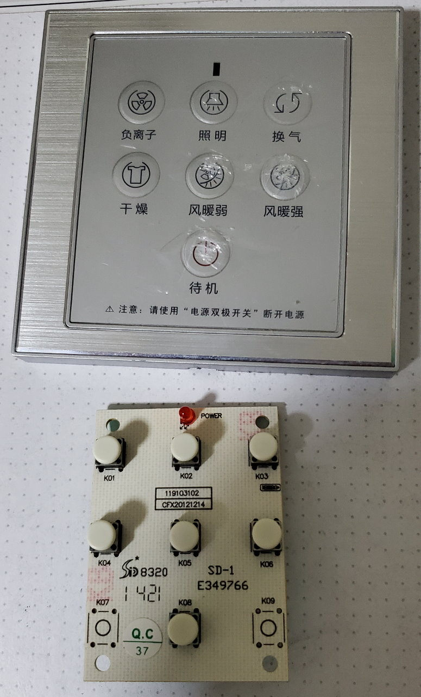
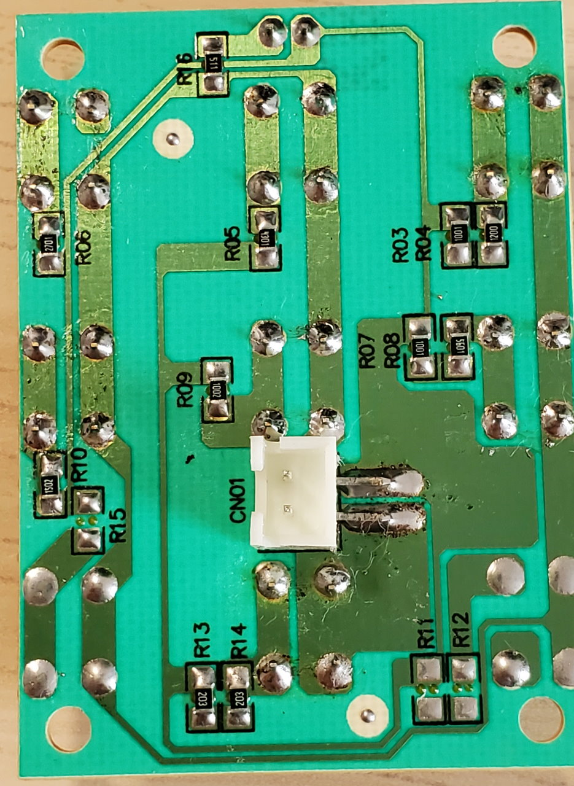
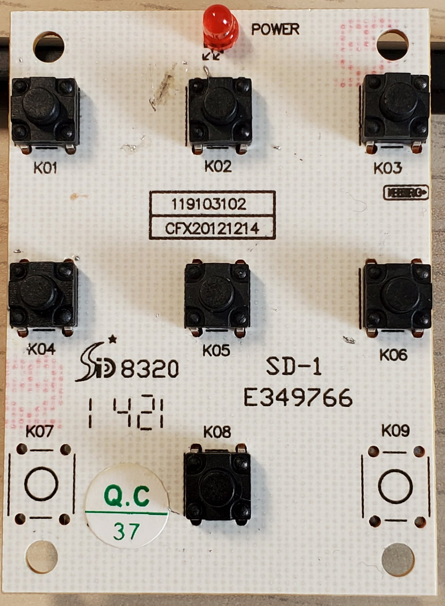
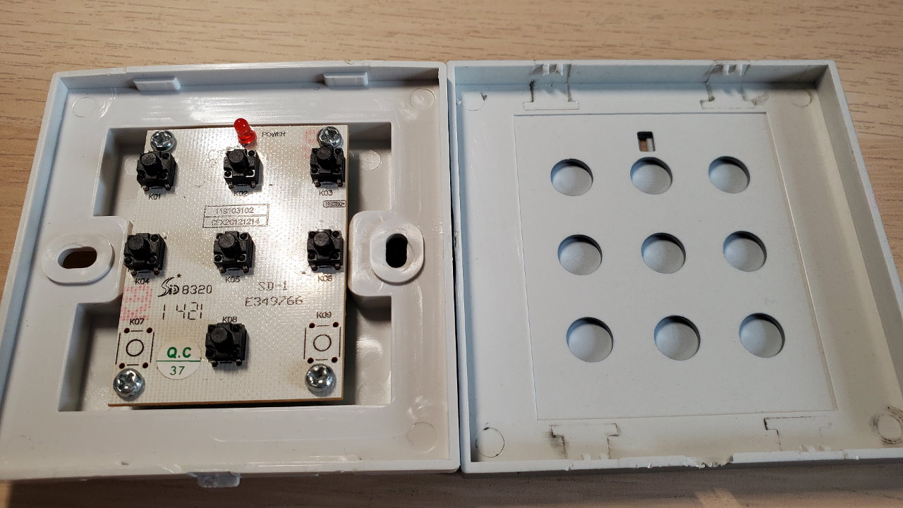

# AUPU-RemoteController
记录（吐槽）一下某型号奥普浴霸遥控面板设计

主机和面板用一对导线连接。主机依不同的电阻值来识别用户按下了面板上的哪一个按钮。但，6\*6 带帽轻触开关时间久了触点氧化，产生不小的接触电阻。所以到后期每当你按下一个按钮，根据当时按下的力度、时长、空气湿度等因素会附加随机大小的电阻，其激活的功能随缘。

|按钮|功能|贴片电阻A|贴片电阻B|
|----|----|---------|---------|
|K01|负离子 （吹风）|R3: 1001 (1k)|R4: 1200 (120)|
|K02|照明|R5: 4301 (4.3k)||
|K03|换气|R6: 2701 (2.7k)||
|K04|干燥|R7: 1001 (1k)|R8: 5601 (5.6k)|
|K05|风暖弱|R9: 1002 (10k)||
|K06|风暖强|R10: 1502 (15k)||
|K07|\<undefined\>|R11: \<undefined\>|R12: \<undefined\>|
|K08|待机|R13: 203 (20k)|R14: 203 (20k)|
|K09|\<undefined\>|R15: \<undefined\>||
|POWER|电源 \*|R16: 511 (510)||

1. 每个功能对应电阻A和电阻B串接。
2. 电源 \*（红LED和R16）并接在所有功能按钮上。
3. 面板供电电压疑似 6V
4. 读图仓促，可能有误。
5. 这玩意儿淘宝上卖将近 100 RMB。

## 有图有真相

拆机

PCB背面，已换防水轻触（没吸锡器）

PCB正面，已换防水轻触

面板背面

PCB 设计不会也不折腾，换防水轻触（6\*6\*7 无帽）草草了事。效果还不错。

